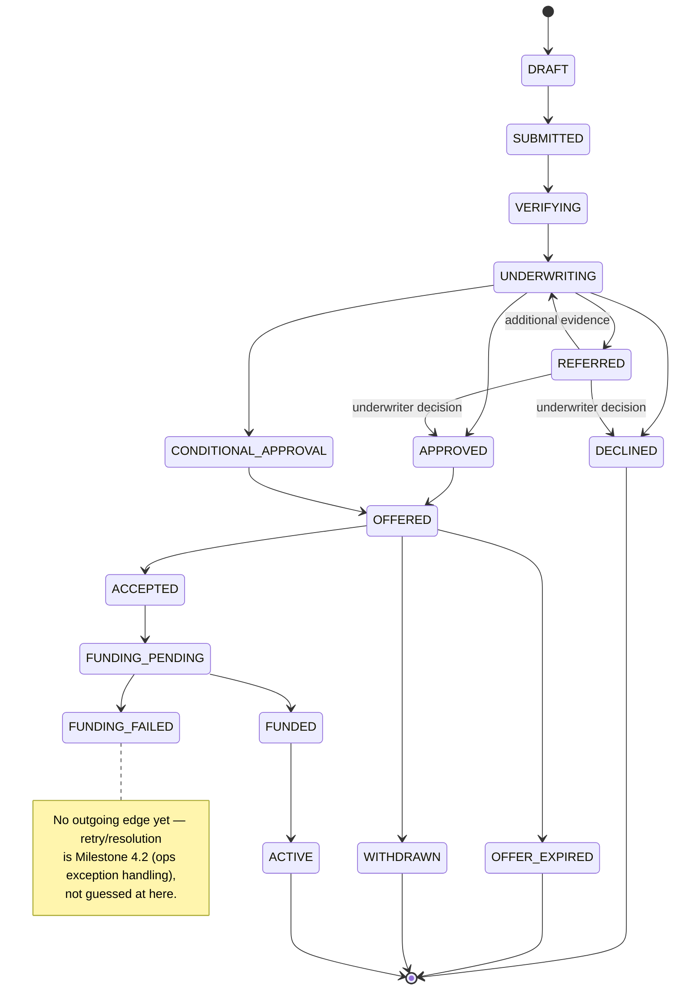
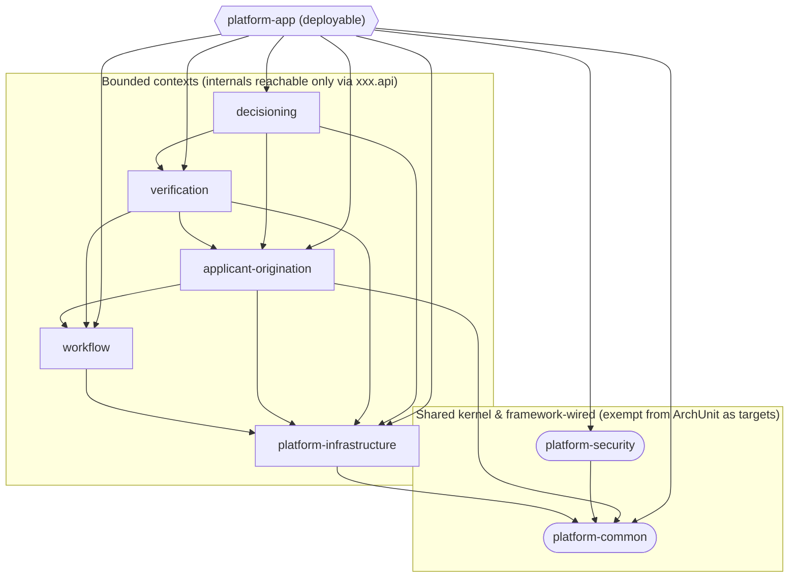
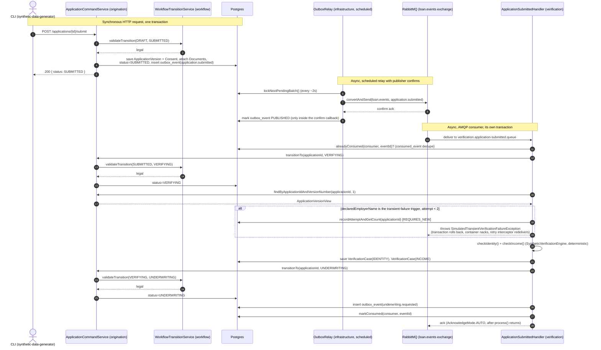

# Architecture diagrams

Living diagrams of the system as actually built, rendered with [Mermaid](https://mermaid.js.org/) so they display natively on GitHub with no build step. These are a companion to `docs/blueprint.md` (the *what/why*) and `docs/roadmap.md` (the *how/when*) — where the prose in those documents and a diagram here disagree, the diagram should be corrected to match the shipped code, not the other way around.

**Update these in the same PR as the code change that invalidates them**, the same discipline as CLAUDE.md's project-state paragraph and the README's status section. Each diagram below names its source of truth in the codebase so "does this diagram still match reality" is a mechanical check, not a judgment call.

This file will grow one diagram per architecturally-significant epic. A polished HTML/CSS rendering is planned as a post-completion portfolio pass — see the epics below for the Mermaid originals that pass will be built from.

## Application lifecycle (state machine)

Source of truth: `workflow/.../workflow/api/ApplicationStatus.java` (the 16 states) and `WorkflowTransitionService.buildTransitionTable()` (the legal edges). Mirrors `docs/blueprint.md` §4.

`WorkflowTransitionService` validates every `from → to` edge shown above and throws `IllegalApplicationTransitionException` (409) on anything not drawn — e.g. funding a declined application or accepting an expired offer. The service is pure validation only; it doesn't persist, audit, or publish. The caller (`ApplicationCommandService` for the `DRAFT → SUBMITTED` hop, `verification`'s `ApplicationSubmittedHandler` for `SUBMITTED → VERIFYING → UNDERWRITING`) owns the entity mutation, `@Audited` call, and outbox enqueue, all inside its own transaction — see ADR 0007.

As of Epic 2.3, live traffic only reaches as far as `UNDERWRITING`; everything from `APPROVED` onward is drawn from the blueprint's state model but not yet exercised by running code (Milestone 3+).

## Module dependency graph

Source of truth: each module's `pom.xml` (`<dependencies>`) for the edges, `ModuleBoundaryTest` for which modules are ArchUnit-enforced. An arrow means "depends on" — it points from the dependent module to the module it compiles against.

`platform-app` is the only executable jar — one deployable hosting both REST controllers and `@RabbitListener`s, per the roadmap's modular-monolith decision. It's also the only module allowed to depend on all seven others; none of the bounded-context modules depend on each other's siblings except through the edges drawn above (e.g. `verification` reaches `applicant-origination` only through `origination.api`'s `ApplicationVersionQueryService`/`ApplicationTransitionService` ports, and `decisioning` reaches both `applicant-origination` and `verification` the same way — the "extract a port on the second real caller" pattern ADR 0007 documents for `workflow`).

`platform-common` and `platform-security` are exempt as ArchUnit *targets* (nothing stops another module from importing their public classes directly — `common` is a shared kernel of value types/base entities/exceptions meant to be used everywhere, and `security` is wired by the Spring framework itself via filter chain/annotations rather than imported directly). They're still bound as *callers*: `ModuleBoundaryTest` would fail if either reached into, say, `infrastructure`'s or `origination`'s internals.

Not yet present: `offers`, `funding`, `notifications` — later Milestone 3+ epics, per the roadmap's module list.

## Submit → verify → underwriting (async golden path)

Source of truth: `ApplicationCommandService.submit`, `OutboxRelay.relay`, `ApplicationSubmittedListener`/`Handler`, `WorkflowTransitionService`. This is the one flow that currently exercises all three of the project's structural pillars at once — the transactional outbox, the shared state-machine validation port, and the AMQP `consumed_event` dedupe mechanism — so it's the clearest single diagram of the async backbone actually working end to end.

Two details that otherwise require reading three separate files to piece together:

- **Steps 11–27 are one `@Transactional` method** (`ApplicationSubmittedHandler.process`). If the transient-failure branch throws, everything in that range rolls back — including the `VERIFYING` transition and the `underwriting.requested` outbox insert — so a redelivered attempt safely re-validates `SUBMITTED → VERIFYING` instead of finding the aggregate already past it. The one exception is the attempt counter itself: `recordAttemptAndGetCount` runs in a separate `REQUIRES_NEW` transaction specifically so the count survives the rollback its own trigger causes.
- **The listener/handler split is deliberate**, not incidental: `@RabbitListener` (not shown as a separate lifeline above — it's a thin wrapper around `Handler`) only acks after `process()` returns, so the message can't be acked before its transaction actually commits. See ADR 0004 for why the opposite ordering was a real bug here in Epic 2.2.

This is also the boundary the state diagram above flags: `Handler` never drives status past `UNDERWRITING`. Epic 3.1's `decisioning` module now picks up from step 26 onward — its `UnderwritingRequestedHandler` consumes `underwriting.requested` in its own transaction and builds the immutable `UnderwritingSnapshot`, but doesn't drive any further status transition itself (Milestone 3's later epics do).